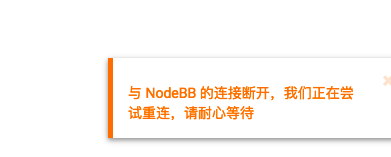
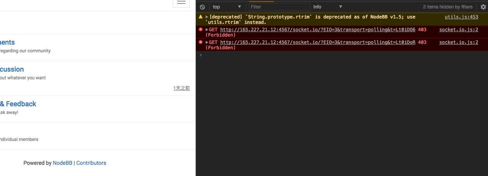
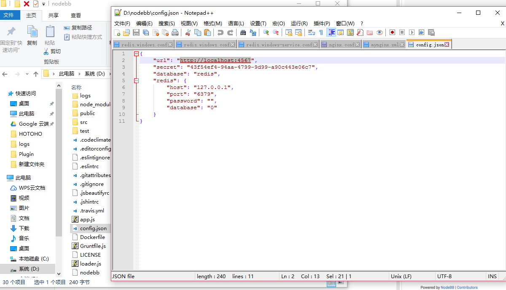

>[success] 这里是 NodeBB 使用中 可能会碰到的 问题和解决方案 篇
> 其中部分来自 NodeBB中国 交流群 中成员所碰到的问题

# NodeBB 问题和解决方案 
[TOC]
## NodeBB 官方 Q&A
### 如何启动/停止/重启NodeBB？
您可以调用 `./nodebb` 来启动和停止NodeBB：
```
$ ./nodebb

Welcome to NodeBB

Usage: ./nodebb {start|stop|reload|restart|log|setup|reset|upgrade|dev}

        start   Start the NodeBB server
        stop    Stops the NodeBB server
        reload  Restarts NodeBB
        restart Restarts NodeBB
        log     Opens the logging interface (useful for debugging)
        setup   Runs the NodeBB setup script
        reset   Disables all plugins, restores the default theme.
        activate        Activate a plugin on start up.
        plugins List all plugins that have been installed.
        upgrade Run NodeBB upgrade scripts, ensure packages are up-to-date
        dev     Start NodeBB in interactive development mode
```
### 如何将NodeBB更新到较新的版本？
请参考 更新 NodeBB
### 我升级了NodeBB，现在 X 不能正常工作！
请参考 更新 NodeBB
### 我安装了一个不兼容的插件，现在我的论坛不能启动！
如果您知道哪个插件导致问题，请通过运行 `./nodebb reset -r nodebb-plugin-pluginName` 禁用它 。
否则，通过运行以下命令禁用所有插件：` ./nodebb reset -p`
### 是否可以通过FTP安装NodeBB？
可以使用 FTP 将文件传输到远程服务器，但是您需要对服务器进行 shell 访问才能在实际上“启动”NodeBB。
附：[在DigitalOcean上安装NodeBB的便捷指南](http://burnaftercompiling.com/nodebb/setting-up-a-nodebb-forum-for-dummies/)
### 我得到一个“npm ERR！” 错误
在大多数情况下，涉及npm的错误是由于 Node.js 过时。如果在运行 `npm install` 时看到类似于此的错误：
```
npm ERR! Unsupported
npm ERR! Not compatible with your version of node/npm: connect@2.7.11
```
您将需要将Node.js版本更新为 4.x 或更高版本。

>[success]  吐槽一下： 跟着教程走不存在 Node.js 过时的问题的。

要在Ubuntu上执行此操作：
```
# Using Ubuntu
$ curl -sL https://deb.nodesource.com/setup_4.x | sudo -E bash -
$ sudo apt-get install -y nodejs

# Using Debian, as root
$ curl -sL https://deb.nodesource.com/setup_4.x | bash -
$ apt-get install -y nodejs
```
如果成功，运行以下命令应显示高于0.8的版本
```
$ node -v
```
### 我的NodeBB（或电子邮件）上的URL仍然有端口号！
如果您使用 nginx 或 Apache 作为反向代理，则不需要显示该端口。只需运行 `./nodebb`setup 并指定没有端口号的URL。
或者，使用您喜欢的文本编辑器 编辑`config.json`并更改`use_port`为`false`。
### “最近登录的IP”部分仅显示127.0.0.1
运行在代理服务器后面的NodeBB可能难以确定请求来自的原始IP地址。代理服务器提供 referral IP header 很重要。
在nginx中，确保 `server` 块中存在以下行：
```nginx
proxy_set_header X-Forwarded-For $proxy_add_x_forwarded_for;
```
另外，确保在NodeBB的 `config.json` 中 `use_port` 设置为 `false`。

## 群内的 Q&A
### 为什么启动 NodeBB 之后会提示 "与xxx的连接断开"？


在浏览器下按 `F12` ，看一下 Console 中是不是提示 连接 `xxx/socket.io/xxx` 报 `403`错误。是的话，请修改`config.json`中的 url 使其与你现在访问的 url 一致。



>[info] 编写: NodeBB-China
维护: PA Team
审核: PA Team
最后更新: 2017.08.08