# Windows 
>[info] 为了您的服务器安全，仅建议 windows 7/10 以及 Windows Server 2012/2016 使用本教程！

[TOC]

## 一、准备 & 安装

>[danger] 根据群友的报告，NodeBB 或者 NodeBB 的 依赖 在 Windows 8 环境下运行时可能会出现错误。所以，我们不推荐在 Windows 8 中继续下面的操作。当然，您也可以选择继续安装。
### §1. Chocolatey ( windows包管理器 )
1. 安装前请检查环境是否到位:
* 系统: Windows 7+ / Windows Server 2003+
* PowerShell v2+
* .NET Framework 4+ (如果你没有安装，那么安装程序在安装时会自动尝试 :D)

>[warning] 尽管 Chocolatey 支持 Windows Server 2003 & 2008 ，但这些系统不再安全了。为了您数据的安全，请将您的 Windows 服务器升级至 2012 或更高。

2. 先熟悉一下大致流程 :D
* 打开一个 具有管理员权限的 Powershell 窗口(administrative shell)。
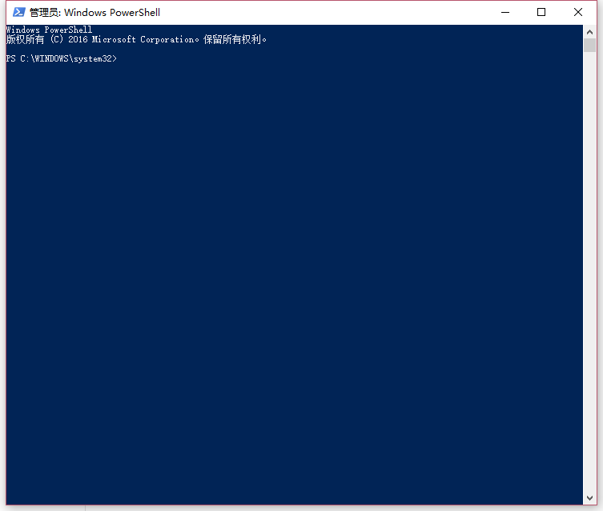

>[danger] ①  尽管 Chocolatey 也支持 在没有管理员权限的窗口下安装，但为了避免以后可能会出现的麻烦，我们不建议你在 无管理员权限 的情况下进行安装
> **② Windows 7 的 Powershell 版本为1.0,并不满足Chocolatey的安装条件，所以请打开一个 *具有管理员权限的CMD窗口* 来代替 Powershell**。当然，你也可以选择 [点击这里](https://www.microsoft.com/zh-CN/download/details.aspx?id=40855) 来升级你的 Powershell 到 4.0
* 复制特定的命令至Shell中( cmd.exe 或 powershell.exe )
* 粘贴进去之后 按 `Enter `键执行
* 等待几秒钟完成命令
* 如果没有看到任何错误，您已经可以使用 Chocolatey 了！现在输入 `choco` 或`choco -?` 试试看？

>[info]需要通过代理服务器安装？ 请参阅 [通过代理服务器安装](https://chocolatey.org/install#installing-behind-a-proxy)。
> 需要完全脱机解决方案？ 请参阅 [完全脱机安装](https://chocolatey.org/install#completely-offline-install)。
> 需要安装许可版？请参阅 [安装许可版本](https://chocolatey.org/docs/installation-licensed)。
> **点击以上链接，将会使你跳转到 Chocolatey 官方安装教程 的 指定内容(English only)**

#### 通过 cmd.exe 安装
执行下面的指令来安装 Chocolatey:
```
@"%SystemRoot%\System32\WindowsPowerShell\v1.0\powershell.exe" -NoProfile -InputFormat None -ExecutionPolicy Bypass -Command "iex ((New-Object System.Net.WebClient).DownloadString('https://chocolatey.org/install.ps1'))" && SET "PATH=%PATH%;%ALLUSERSPROFILE%\chocolatey\bin"
```

#### 通过 PowerShell.exe 安装
~~使用 Powershell 之前，你还需要一个额外的步骤来检测 Powershell 的配置。您必须保证Get-ExecutionPolicy不受限制。我们建议使用`Bypass`或安全性更高一点的`AllSigned`来绕过该策略来安装。~~
~~在 Powershell 下执行:~~
```
Get-ExecutionPolicy
```
~~如果 返回的是 `Restricted`的话，那就执行 `Set-ExecutionPolicy AllSigned` 或 `Set-ExecutionPolicy Bypass` 来改变策略。~~

---------------------------------------------------------
>[info] 好吧，上面的就当是普及一下常识。现在只需要执行以下命令即可~

执行下面的指令来安装 Chocolatey:
```
Set-ExecutionPolicy AllSigned; iex ((New-Object System.Net.WebClient).DownloadString('https://chocolatey.org/install.ps1'))
```
#### 升级 Chocolatey 
```
choco upgrade chocolatey
```
#### 卸载 Chocolatey
请参考: https://chocolatey.org/docs/uninstallation
### §2. 安装 必要的工具 &  数据库 & Node.js LTS
```
#使用 具有Admin权限的Shell
choco install -y imagemagick github python2 nodejs-lts git
choco install -y mongodb #使用 Mongodb 作为 储存器?
choco install -y redis-64 #使用 Redis 作为 储存器? 
#如果使用的是32bit的系统 请使用 cinst -y redis 代替
choco install nginx #需要 进行反向代理 ?
```
## 二、配置

>[info] 在开始之前: Windows7 在使用 Chocolatey 安装完依赖后，可尝试使用 PowerShell 完成下面的操作。
### §1.Node.js
* 输入下面的指令以确认安装:
```
node -v
npm -v
```
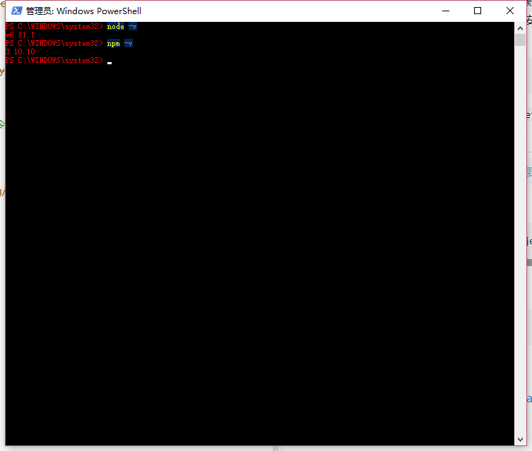

### §2.Databases
#### MongoDB (推荐)
MongoDB 是一个比较优秀的 NoSQL 数据库。相比 Redis ，它更适用大型高负载的社区使用。
1. 将 Mongodb 的 bin 加入 PATH

找到 Mongodb 的 bin 目录，然后把它加入 系统环境变量 path 内。（一般 Mongodb 会在下图位置哦！）
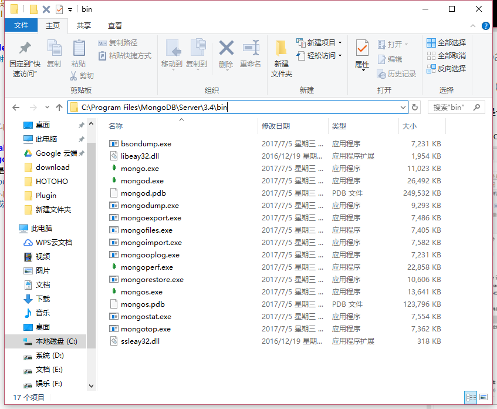
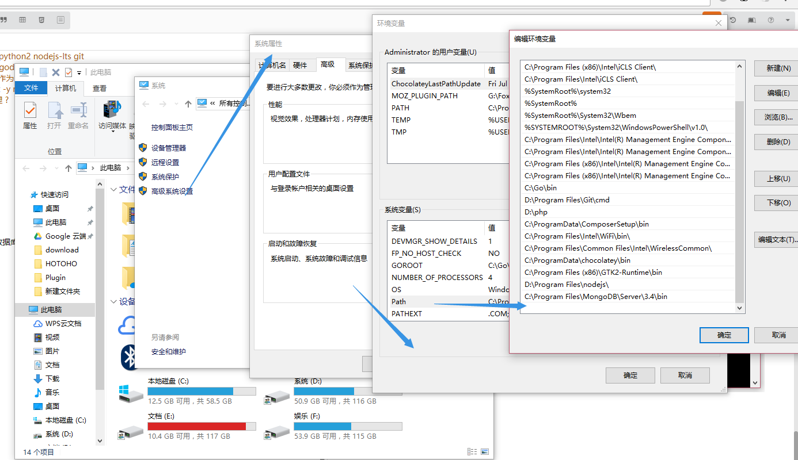

>[info] 建议把 Mongodb 的那项上移到最前面:D
2. 检测是否成功生效

关闭当前的 Powershell 窗口(CMD窗口)，然后再新建一个，输入下面的指令:
```
mongo --version
```
不出意外，你得到的结果应该和下图类似:
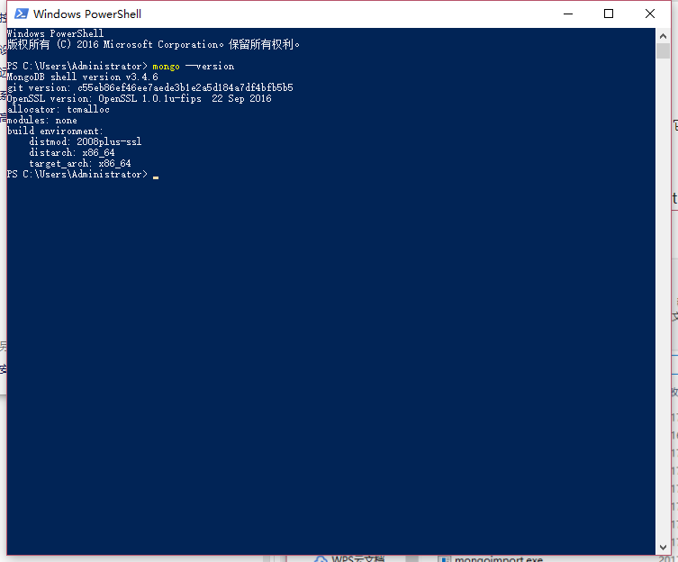

3. 新建下面的两个文件夹 

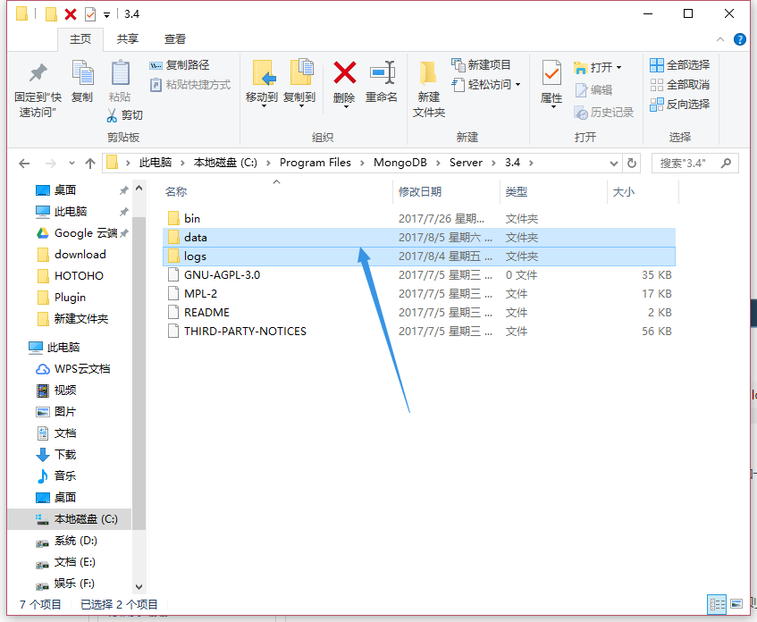

4. 在 Shell 中 输入：
```
mongod --dbpath 'C:\Program Files\MongoDB\Server\3.4\data' --logpath 'C:\Program Files\MongoDB\Server\3.4\logs\mongodb.log' --install
```
>[info] 因为路径中出现空格，所有我们给`dbpath`和`logpath`指定路径的时候需要加一个引号来避免字符串截断的问题。
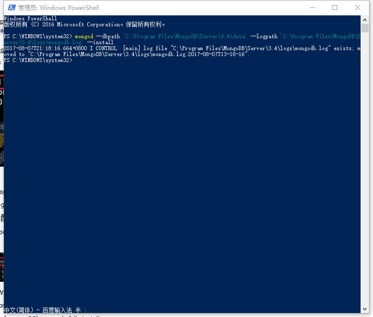
我由于是安装过了，所以才会提示 log 已存在。正常安装，应该不会出现报错信息
5. 启动 MongoDB
* `Ctrl` +`R` 调出快速启动框，输入 `services.msc` 按下 `Enter`键
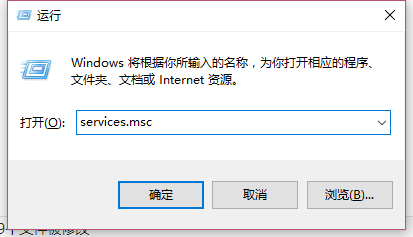

* 启动服务
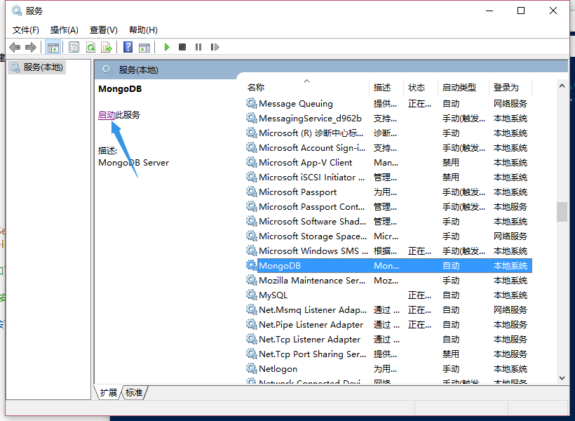

6. 为 NodeBB 安装 配置数据库(**详细 可参考 配置MongoDB 章节**)
* 连接数据库
```
mongo
```
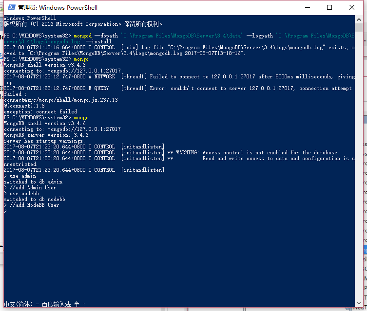

* 创建 Admin 账户
```
> use admin
> db.createUser( { user: "替换成你想要的Admin帐户名", pwd: "替换成你的Admin账户的密码", roles: [ { role: "readWriteAnyDatabase", db: "admin" }, { role: "userAdminAnyDatabase", db: "admin" } ] } )
```
* 创建 NodeBB 账户
```
> use nodebb
> db.createUser( { user: "nodebb", pwd: "替换成你的NodeBB账户的密码", roles: [ { role: "readWrite", db: "nodebb" }, { role: "clusterMonitor", db: "admin" } ] } )
```
* 退出数据库
```
> exit
```
7. 打开 Mongodb 的权限认证器，并重启服务
* `Ctrl` +`R` 调出快速启动框，输入 `regedit` 按下 `Enter`键
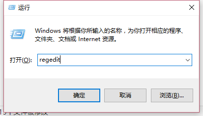
* 找到 `[HKEY_LOCAL_MACHINE-->SYSTEM-->CurrentControlSet-->Services-->MongoDB]` 中的 `ImagePath` ,在它的键值后加 `--auth`
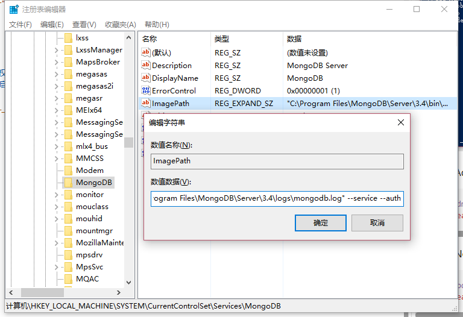
* 重启服务
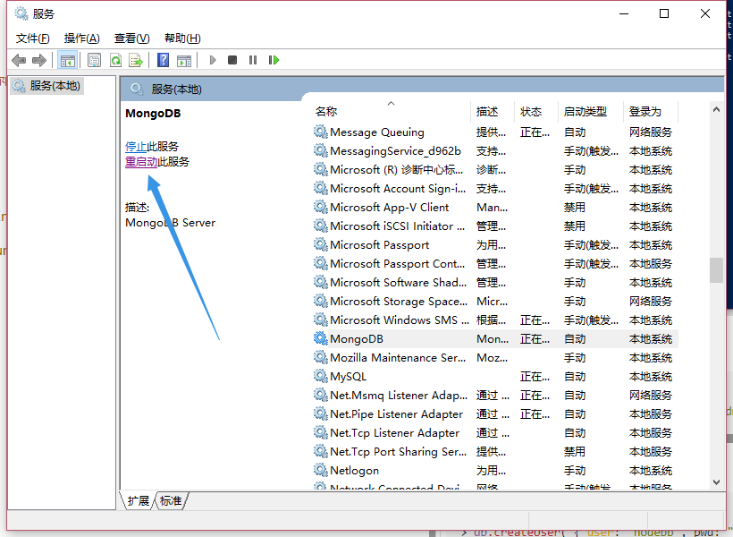
* 验证: 是否能成功登录 (请参考 配置MongoDB 章)

-----------
#### Redis
>[warning] 我这里 Redis 配置失败....暂时就不编写了吧:(

### §3. NodeBB

1. 利用 Powershell 到一个你喜欢的位置，然后克隆nodebb库，如
```
cd D:\
git clone -b v1.7.x https://github.com/NodeBB/NodeBB.git nodebb
```
>[info] 现在，你可以使用国内的镜像仓库(`https://gitee.com/NodeBB-CN/NodeBB.git`)来提高连接速度。
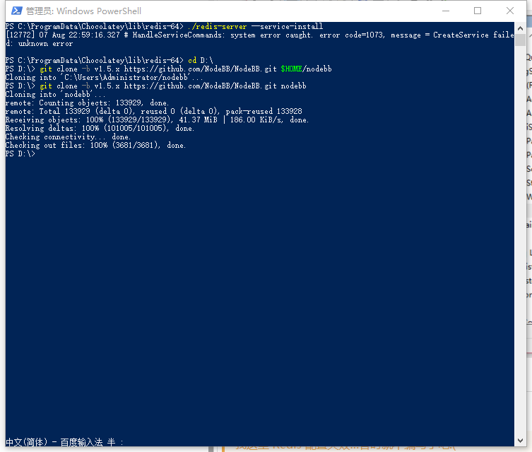
2. 安装 NodeBB 依赖
```
npm i --producation
```
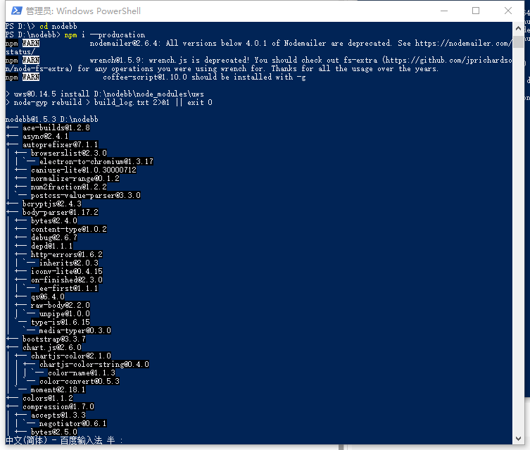
3. 配置 NodeBB
```
./nodebb setup

```
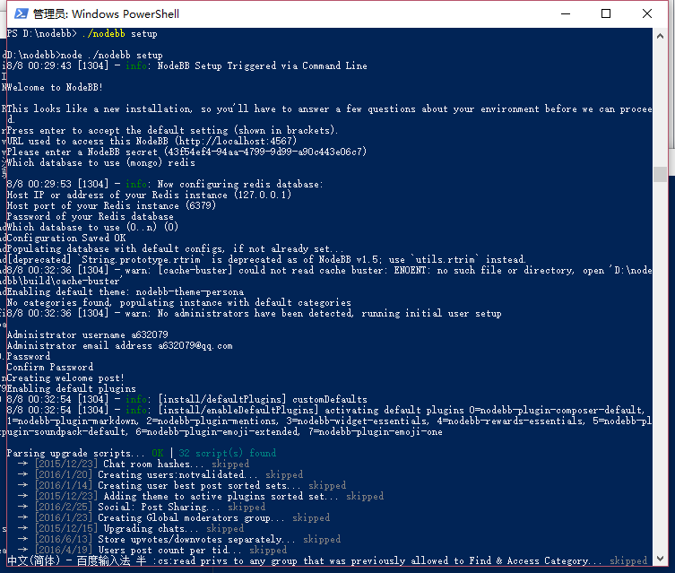
4. 启动 NodeBB
```
./nodebb start
#CMD 使用: nodebb start
```
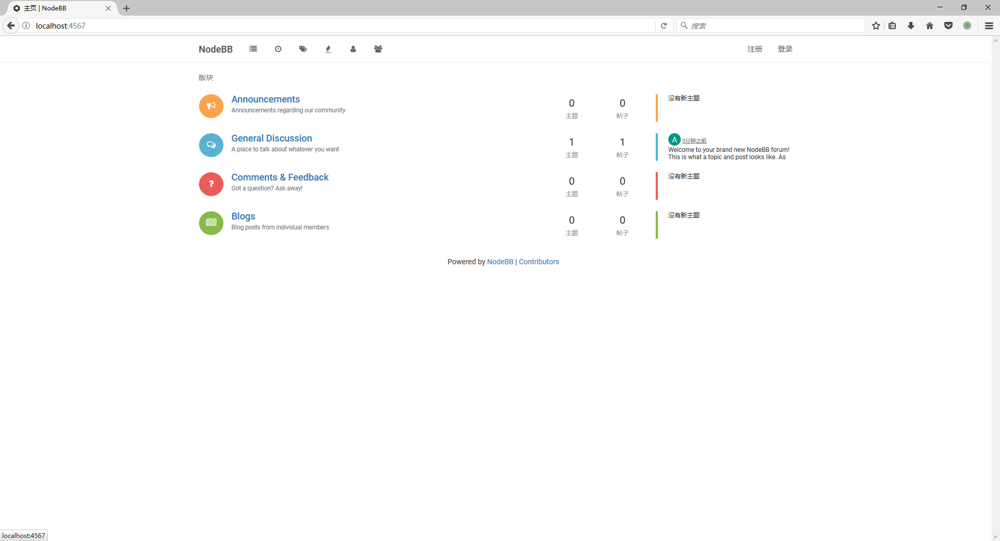
Enjoy it!
#### §4. Nginx (反代)

1. 配置 Nginx
首先确认你的 Nginx 版本:
```
nginx -v
```
>[info]截止 2017.08.08 从 Chocolatey 下载的 Nginx 版本为:`1.12.1`

然后我们进入目录，编辑配置，把下面那段配置复制到 http 节下(需要更多配置? 请参考 配置 Nginx 篇):
```
server {
    listen 80;

    server_name 改成你要的域名;

    location / {
        proxy_set_header X-Real-IP $remote_addr;
        proxy_set_header X-Forwarded-For $proxy_add_x_forwarded_for;
        proxy_set_header X-Forwarded-Proto $scheme;
        proxy_set_header Host $http_host;
        proxy_set_header X-NginX-Proxy true;

        proxy_pass http://127.0.0.1:4567;
        proxy_redirect off;

        # Socket.IO Support
        proxy_http_version 1.1;
        proxy_set_header Upgrade $http_upgrade;
        proxy_set_header Connection "upgrade";
    }
}
```
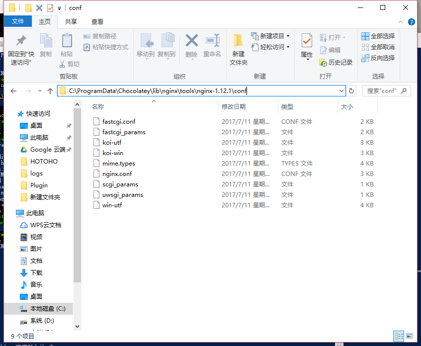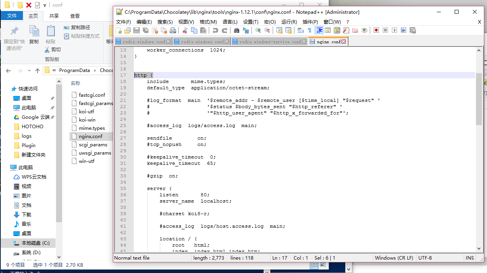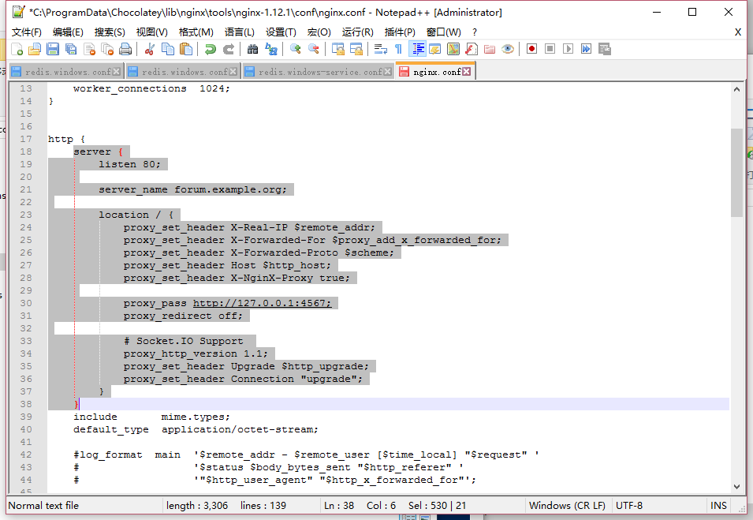

2. 把 Nginx 注册成系统服务
访问 `https://github.com/kohsuke/winsw/releases` 下载 Windows service wrapper.

>[info] 64位系统下载 `WinSW.NET4.exe` 32位系统下载 `WinSW.NET2.exe`

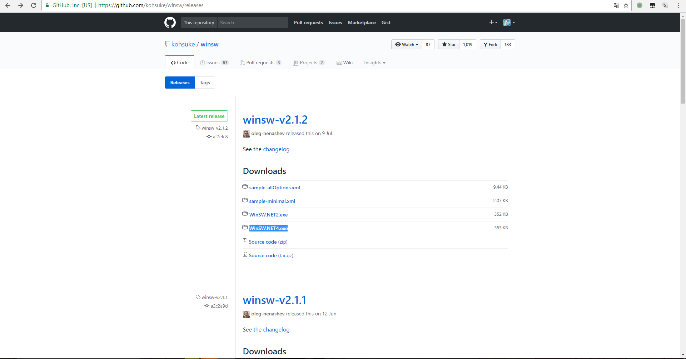
然后，把 `WinSW.NET*.exe` 重命名为 `mynginx.exe` 后，移到和 `nginx.exe` 同级的目录
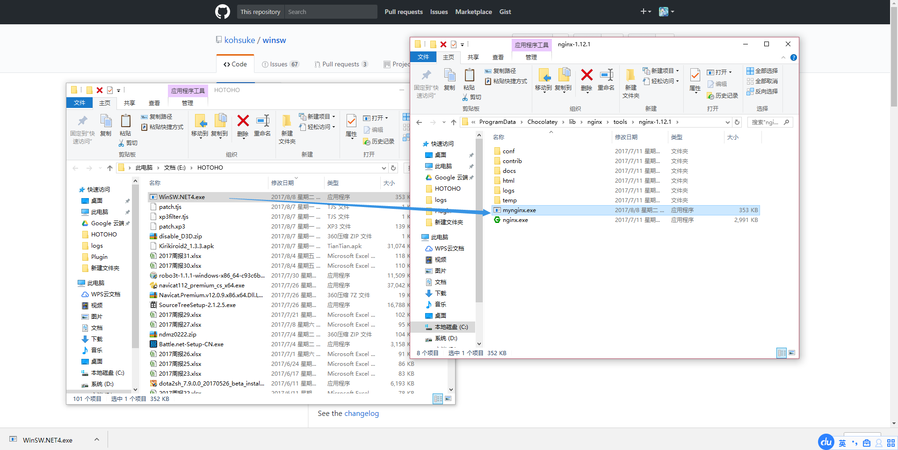
新建一个文本文档，改名为 `mynginx.xml`，编辑它，加入下面的内容(记得替换对应的目录):
```
<service>
	<id>nginx</id>
	<name>nginx</name>
	<description>nginx</description>
	<logpath>C:\ProgramData\Chocolatey\lib\nginx\tools\nginx-1.12.1\</logpath>
	<logmode>roll</logmode>
	<depend></depend>
	<executable>C:\ProgramData\Chocolatey\lib\nginx\tools\nginx-1.12.1\nginx.exe</executable>
	<stopexecutable>C:\ProgramData\Chocolatey\lib\nginx\tools\nginx-1.12.1\nginx.exe -s stop</stopexecutable>
</service>
```
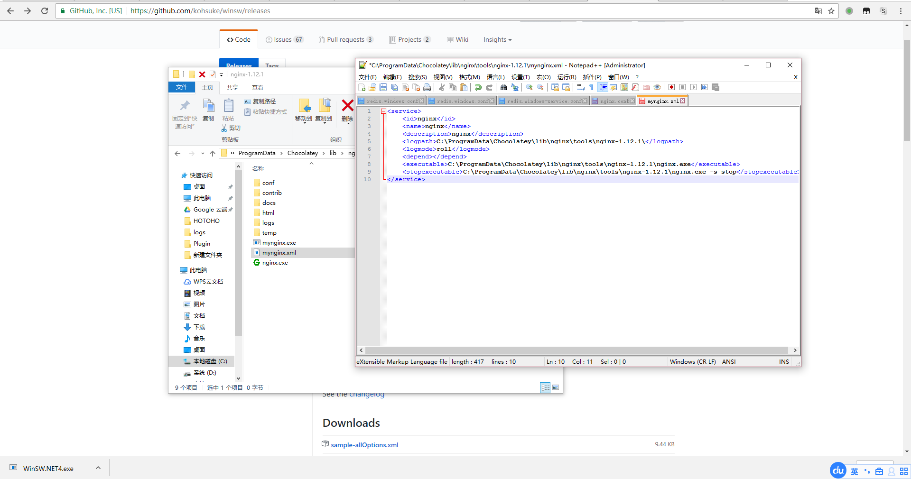
cmd(具有管理员权限) 转移到 nginx 目录，然后输入 `mynginx.exe install` 安装它。
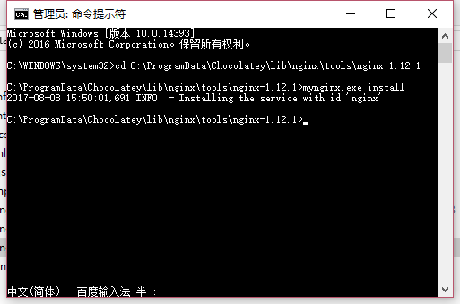
3. 启动 Nginx
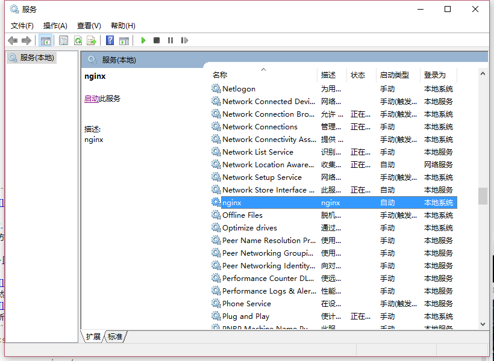
4. 把域名解析至服务器，然后即可使用URL访问你的 NodeBB 了。

-----------------------
>[info] 编写: a632079
维护: a632079
审核: PA Team
最后更新: 2017.11.26