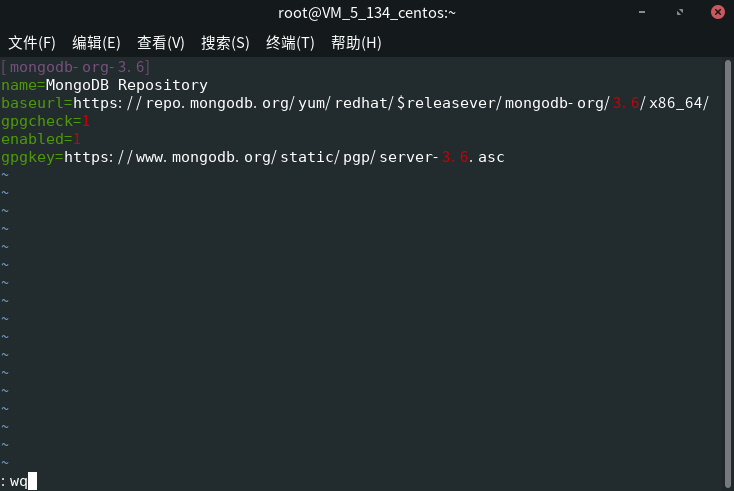

# AppNode
[TOC]

## 简介

AppNode是 Linux 下的一款集群部署的可视化控制面板，一键安装，具体功能的体验。

提供：
* 可视化管理，提升运维效率  
* 快速安装，轻松升级  
* 轻便高效，节约系统资源
* 将支持主流的 Linux 发行版本 (***目前仅支持 CentOS***)
* 集中式设计，快速切换管理
* 软件丰富，按需安装
* 遵循通用规范，系统更原汁原味
* 开放的 API 结构，便于扩展和整合

AppNode 提供系统信息、软件管家、文件管理、服务管理、进程管理、防火墙管理、 用户管理等基本的Linux运维功能，通过可视化操作界面降低了 Linux 使用的门槛。

> *来源: 《百度百科》*
 
## 安装
### AppNode
>[danger] 由于 AppNode 目前仅支持 CentOS ，所以本文是基于 CentOS 7.3 的环境进行指导的。


>[info] Windows 下推荐使用 Xshell ，对于新手非常友好，易用。

进入 AppNode 官网 (https://www.appnode.com/install) ，进行基础配置后，获得下载地址。然后复制进 SSH 终端，按下回车以安装。

安装过程中会要求配置基础信息，请根据自己的需求进行填写：

最后一个选项是让你确认信息是否填写正确。如果正确我们输入 `y` 即可，如果不正确，就键入 `n` 以重新填写信息。


当我们看到这则消息时，就意味着安装成功了，赶快在浏览器中输入 URL 来登入自己的 AppNode 吧。


输入管理员账户信息，点击 Sign In （登入）


这就是 AppNode 的 Panel 了，看到这界面就意味着：您的 AppNode 已经成功安装，且您的管理员信息是正确的。
### Node.js
Node.js 是 NodeBB 的运行时环境。目前推荐使用 v8.x (LTS)。由于 AppNode 已经提供 Node.js 的安装方法，所以我们直接通过面板安装。

1. 点击 软件管家
2. 在搜索框输入 "Node.js"，点击 搜索
3. 找到 Node.js 点击 一键安装
4. 在弹出的确认框中点击 立即安装

### Redis
Redis 是一个优秀的内存缓存应用。同时也是 NodeBB 的一个数据库选择。但本文里我们着重介绍的是配置其作为 NodeBB 的 Session 缓存器。

>[info] 如果您有意将其作为 NodeBB 的数据储存器，那么您可以跳过下方的 MongoDB，以及稍后的 "配置 Redis 作为 Session 储存器"


同样的，AppNode 已经为我们提供 Redis 的安装方法，我们只需要进行下面的步骤即可安装：
1. 输入 "Redis"，点击 搜索
2. 找到 Redis服务器 点击 一键安装
3. 在弹出的确认框中点击 立即安装

### MongoDB
NodeBB 目前推荐使用 MongoDB 作为数据存储器，但 AppNode 尚未提供 MongoDB 的安装方法，所以我们需要通过 命令终端 来安装。

首先，通过点击 “Home” 进入 桌面。然后，我们点击 “命令终端”，运行 Web Shell （实际就是个 SSH Shell）。

之后我们将通过它，来安装 MongoDB，以及安装配置 NodeBB。

>[info] $ 代表在终端里的指令，> 代表在 MongoDB 或者 Redis 中的指令。

#### 配置 MongoDB 源
```
$ vim /etc/yum.repos.d/mongodb-org-3.6.repo
```
1. 输入上方的指令
2. 键入 `i` 开启编辑模式
3. 将下方的内容复制进去
4. 按下 `Esc` 键，并键入 `:wq` 以保存

```
[mongodb-org-3.6]
name=MongoDB Repository
baseurl=https://repo.mongodb.org/yum/redhat/$releasever/mongodb-org/3.6/x86_64/
gpgcheck=1
enabled=1
gpgkey=https://www.mongodb.org/static/pgp/server-3.6.asc
```
完成后，看起来类似这样 （笔者使用的是 Linux SSH 终端，但 Web SSH 终端体验应于此类似）

