# AppNode
[TOC]

## 简介
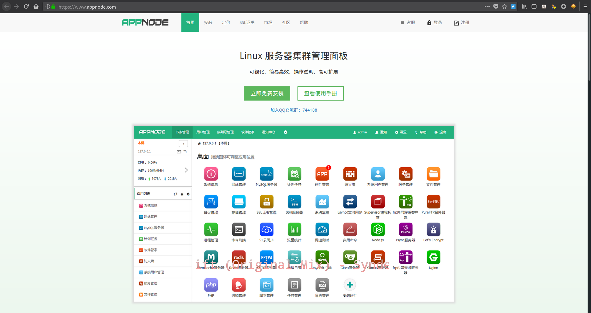
AppNode是 Linux 下的一款集群部署的可视化控制面板，一键安装，具体功能的体验。

提供：
* 可视化管理，提升运维效率  
* 快速安装，轻松升级  
* 轻便高效，节约系统资源
* 将支持主流的 Linux 发行版本 (***目前仅支持 CentOS***)
* 集中式设计，快速切换管理
* 软件丰富，按需安装
* 遵循通用规范，系统更原汁原味
* 开放的 API 结构，便于扩展和整合

AppNode 提供系统信息、软件管家、文件管理、服务管理、进程管理、防火墙管理、 用户管理等基本的Linux运维功能，通过可视化操作界面降低了 Linux 使用的门槛。

> *来源: 《百度百科》*
 
## 安装
### AppNode
>[danger] 由于 AppNode 目前仅支持 CentOS ，所以本文是基于 CentOS 7.3 的环境进行指导的。

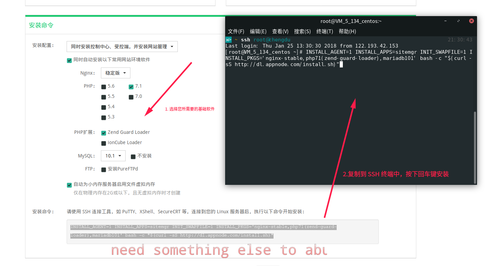

>[info] Windows 下推荐使用 Xshell ，对于新手非常友好，易用。

进入 AppNode 官网 (https://www.appnode.com/install) ，进行基础配置后，获得下载地址。然后复制进 SSH 终端，按下回车以安装。

安装过程中会要求配置基础信息，请根据自己的需求进行填写：
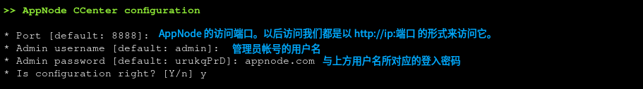
最后一个选项是让你确认信息是否填写正确。如果正确我们输入 `y` 即可，如果不正确，就键入 `n` 以重新填写信息。

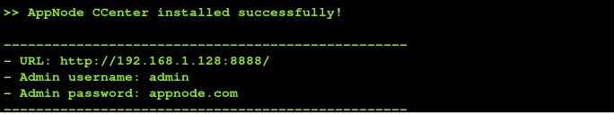
当我们看到这则消息时，就意味着安装成功了，赶快在浏览器中输入 URL 来登入自己的 AppNode 吧。

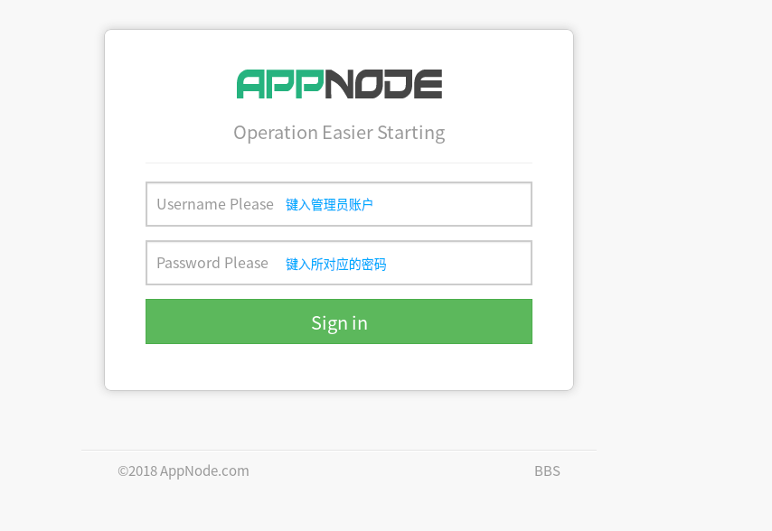

输入管理员账户信息，点击 Sign In （登入）

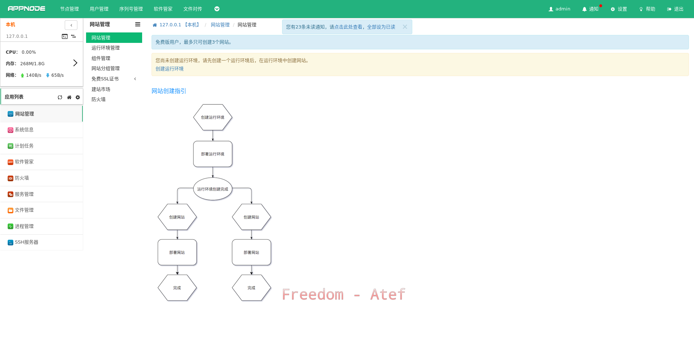
这就是 AppNode 的 Panel 了，看到这界面就意味着：您的 AppNode 已经成功安装，且您的管理员信息是正确的。
### Node.js
Node.js 是 NodeBB 的运行时环境。目前推荐使用 v8.x (LTS)。由于 AppNode 已经提供 Node.js 的安装方法，所以我们直接通过面板安装。
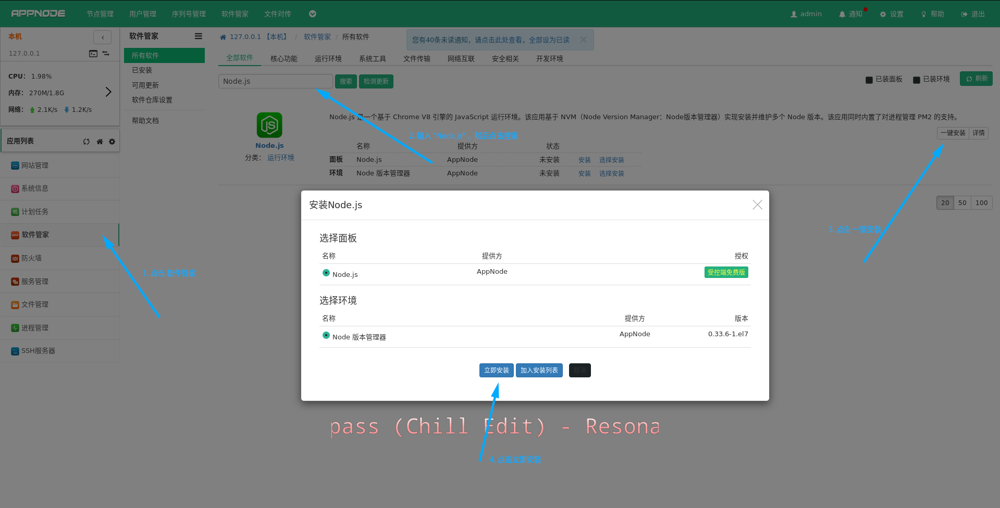
1. 点击 软件管家
2. 在搜索框输入 "Node.js"，点击 搜索
3. 找到 Node.js 点击 一键安装
4. 在弹出的确认框中点击 立即安装

然后刷新页面
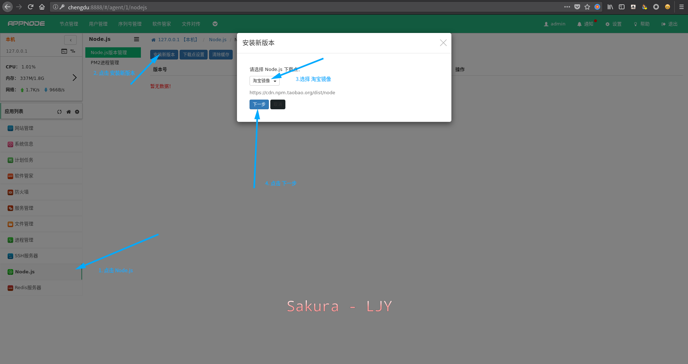
1. 点击 Node.js
2. 点击 安装新版本
3. 选则淘宝源
4. 点击下一步
5. 选择立即安装 （只需要选择 LTS 即可）

到此，Node.js 安装成功。
### Redis
Redis 是一个优秀的内存缓存应用。同时也是 NodeBB 的一个数据库选择。但本文里我们着重介绍的是配置其作为 NodeBB 的 Session 缓存器。

>[info] 如果您有意将其作为 NodeBB 的数据储存器，那么您可以跳过下方的 MongoDB，以及稍后的 "配置 Redis 作为 Session 储存器"

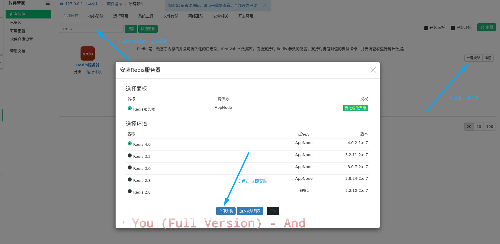
同样的，AppNode 已经为我们提供 Redis 的安装方法，我们只需要进行下面的步骤即可安装：
1. 输入 "Redis"，点击 搜索
2. 找到 Redis服务器 点击 一键安装
3. 在弹出的确认框中点击 立即安装

然后，我们启动它，并设置开机自启，守护。
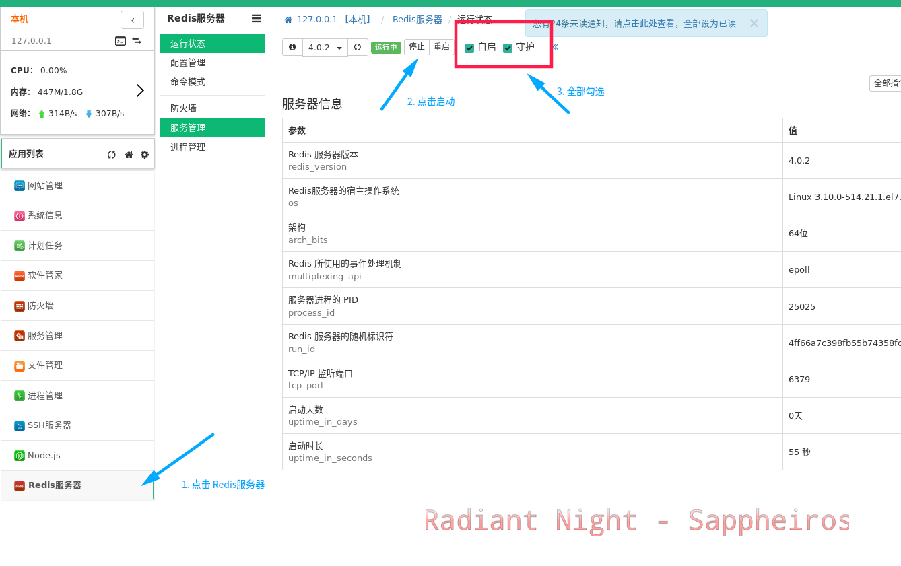
1. 点击 Redis 服务器
2. 点击 启动/运行
3. 勾选自启，守护

### MongoDB
NodeBB 目前推荐使用 MongoDB 作为数据存储器，但 AppNode 尚未提供 MongoDB 的安装方法，所以我们需要通过 命令终端 来安装。
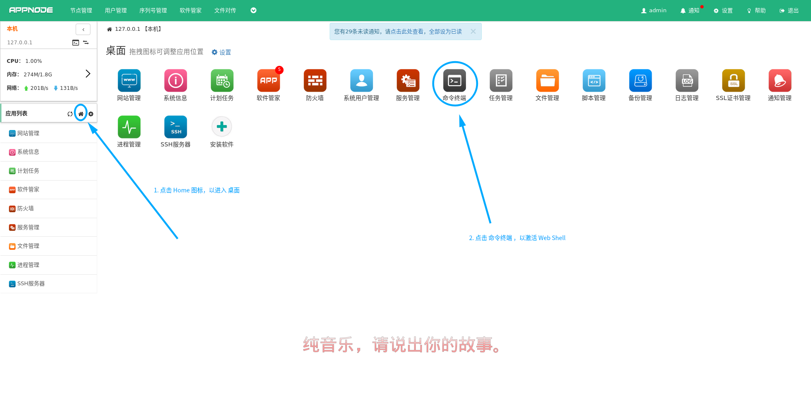
首先，通过点击 “Home” 进入 桌面。然后，我们点击 “命令终端”，运行 Web Shell （实际就是个 SSH Shell）。
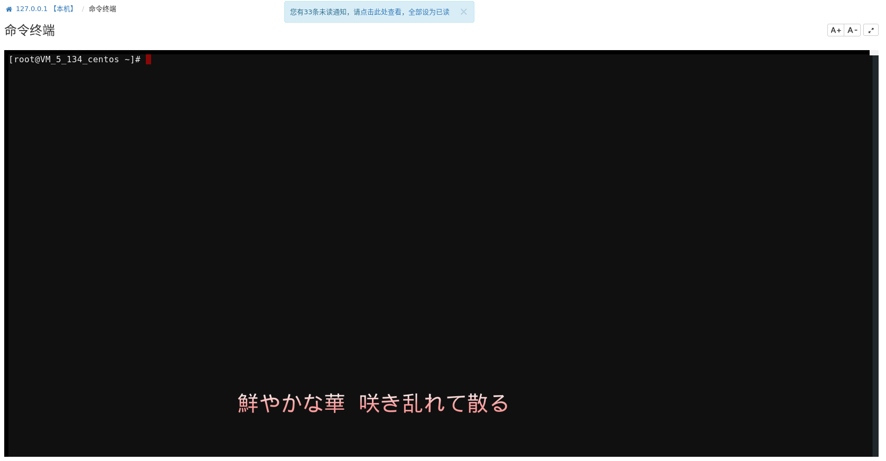
之后我们将通过它，来安装 MongoDB，以及安装配置 NodeBB。

>[info] $ 代表在终端里的指令，> 代表在 MongoDB 或者 Redis 中的指令。

#### 配置 MongoDB 源
```
$ vim /etc/yum.repos.d/mongodb-org-3.6.repo
```
1. 输入上方的指令
2. 键入 `i` 开启编辑模式
3. 将下方的内容复制进去
4. 按下 `Esc` 键，并键入 `:wq` 以保存

```
[mongodb-org-3.6]
name=MongoDB Repository
baseurl=https://mirrors.aliyun.com/mongodb/yum/redhat/$releasever/mongodb-org/3.6/x86_64/
gpgcheck=1
enabled=1
gpgkey=https://www.mongodb.org/static/pgp/server-3.6.asc
```
完成后，看起来类似这样 （笔者使用的是 Linux SSH 终端，但 Web SSH 终端体验应与此类似）
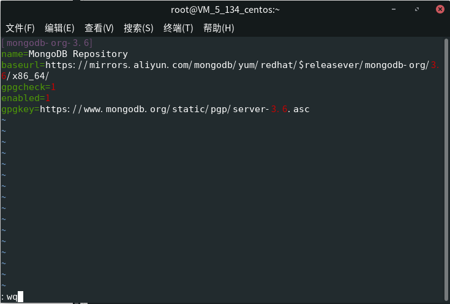
然后，我们使用以下指令以启动 MongoDB 并设置开机自启动。
```
$ systemctl enable mongod
$ systemctl start mongod
```
#### 更新源并安装

```
* 允许获得统计数据
```
>  db.grantRolesToUser("nodebb",[{ role: "clusterMonitor", db: "admin" }]);
```
* 退出
```
> exit
```

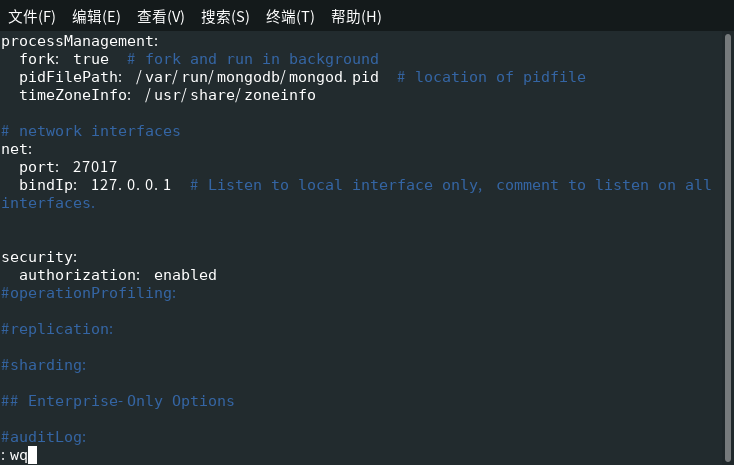
*  打开 MongoDB 权限认证
 执行 `vim /etc/mongod.conf`，找到 `security: `这一行，取消注释并改为：
 
 ```
 security:
   authorization: enabled
 ```
 * 重启服务
 ```
 $ service mongod restart
 ```
### 获取 NodeBB

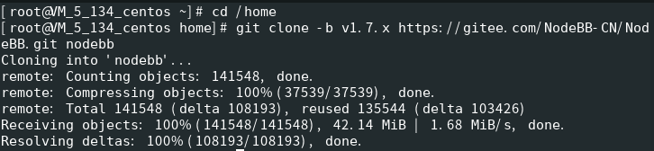

>[info] 此步需在 命令终端 下执行

选择一个你喜欢的位置，例如: `/home`，然后我们执行：
```
$ cd /home # 改变目录为 /home
$ git clone -b v1.7.x https://gitee.com/NodeBB-CN/NodeBB.git nodebb
```
### 配置 NodeBB
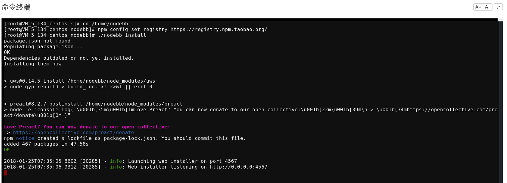

>[info] 此步需在 命令终端 下执行

在 NodeBB 目录(例如: `/home/nodebb`)下，执行以下指令：
```
$ npm config set registry https://registry.npm.taobao.org/ # 设置淘宝源
$ ./nodebb install
```
访问 `http://yourip:8888` 以进行配置 NodeBB
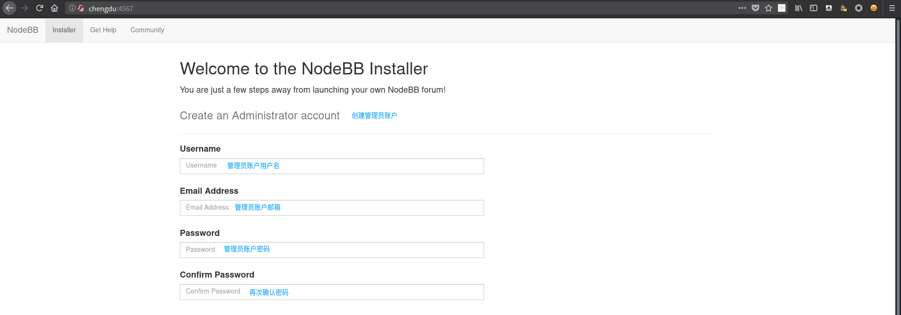
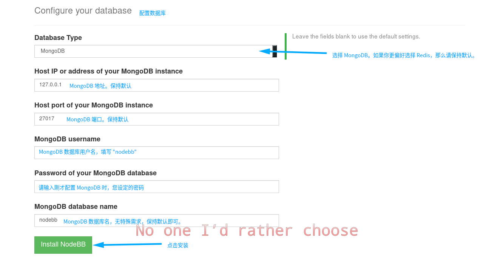

安装成功
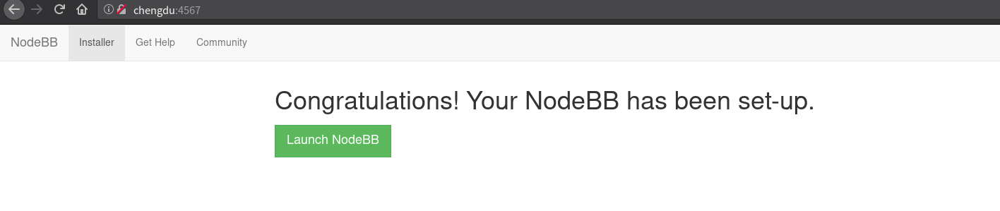

### 配置 Redis 作为 Session 存储器
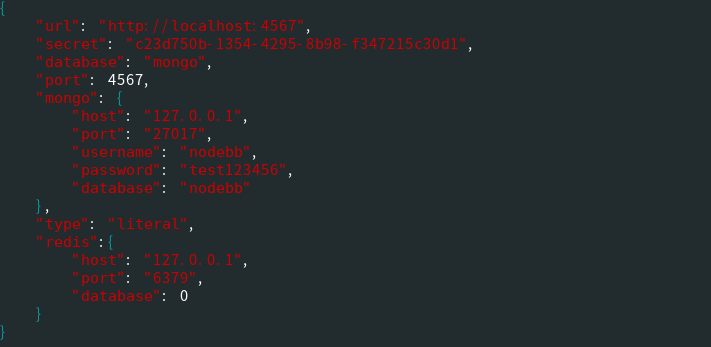

>[info] 此步需在 命令终端 下执行

在 NodeBB 目录下，使用 `vim config.json`将以下文本添加在 `config.json` 的最后（在最后一个`}`之前）：
```
     ,
    "redis":{
        "host": "127.0.0.1",
        "port": "6379",
        "database": 0
    }
```
### 使用 pm2 启动 NodeBB
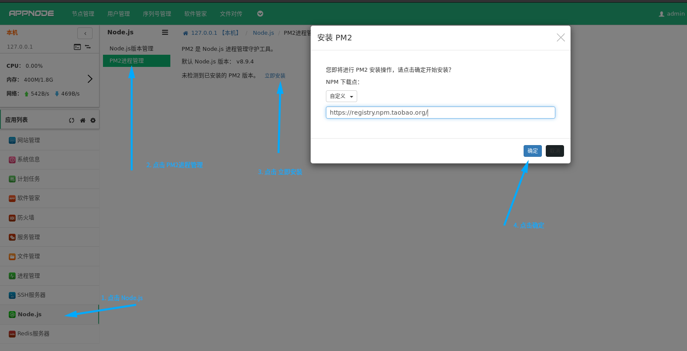
1. 点击 Node.js
2. 点击 PM2进程管理器
3. 点击立即安装
4. 点击 确定

然后，我们：
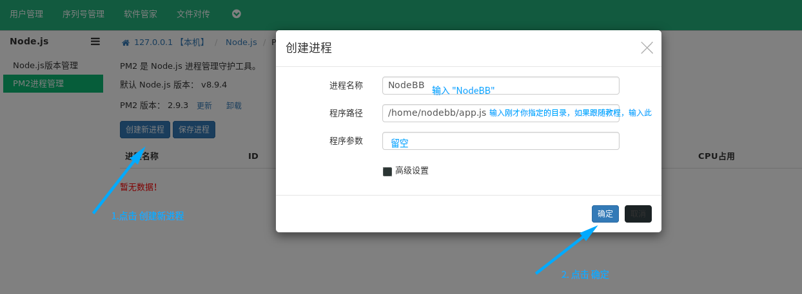
1. 点击 创建新进程，然后在弹出框里填写信息
2. 点击确定

3. 等待添加成功后，点击保存进程
访问一下，恩，成功访问。
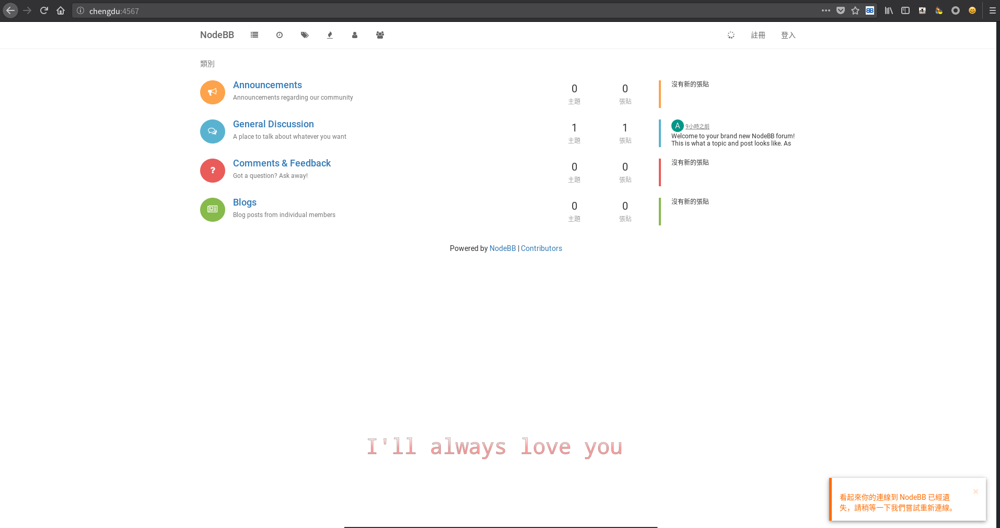

### 使用 Nginx 配置 反向代理
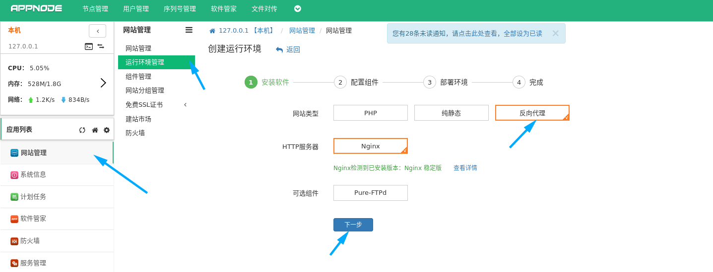
1. 选择 网站管理
2. 选择 运行环境管理
3. 在网站类型 选择 反向代理
4. 选择下一步，再下一步
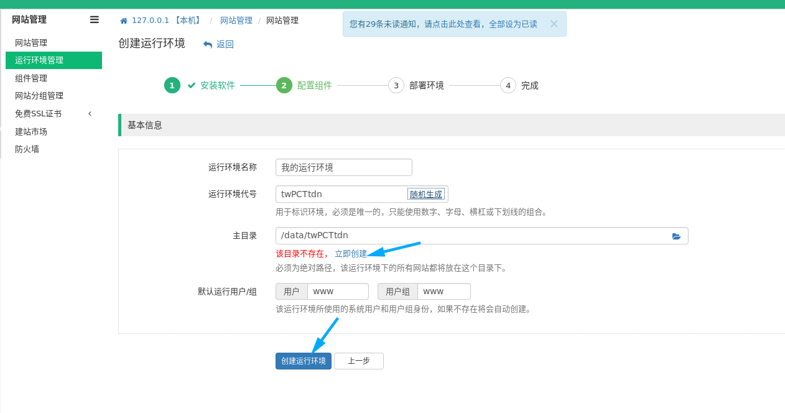
5. 点击创建目录
6. 点击 创建运行环境，然后点击开始部署。
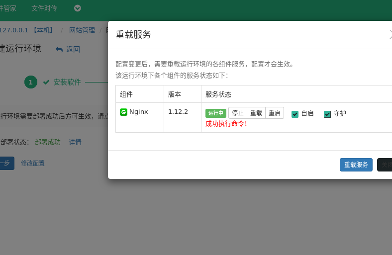
. 