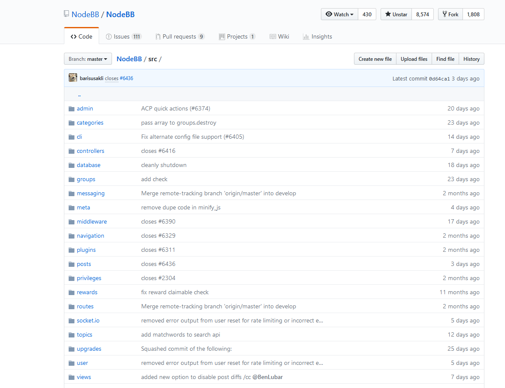

NodeBB 自身携带了一系列方法， 我们将其称为 `NodeBB 系统函数库`。 NodeBB 系统函数库包含数据库操作， 权限管理， 用户操作， 路由管理， socket.io操作等快捷的方法。 出于快速开发的考虑， NodeBB 团队开放了系统函数库给开发者们调用。作为开始开发的第一步， 建议初步了解 NodeBB 系统函数库的使用方法。
函数库位置： https://github.com/NodeBB/NodeBB/tree/master/src

## 常用方法
在本节中， 我们会初步介绍 NodeBB 函数库的基本使用方法， 以及常用的方法。

### 申明函数库
```
  // 系统函数库
  const user = module.parent.require('./user')
  const db = module.parent.require('../src/database')
  const meta = module.parent.require('./meta')
  const utils = module.parent.require('../public/src/utils')
  
  // 常用模块
  const async = module.parent.require('async')
  const nconf = module.parent.require('nconf')
  const winston = module.parent.require('winston')
  const path = module.parent.require('path')
```
>[info] 以上是相对常用的 NodeBB 函数库 以及 NodeBB依赖模块 的申明

一次申明所有常用的函数库是一个十分有助于提高开发效率的手段， 可以避免在开发过程中多次回到文件头添加申明。
### 用户表操作
本节将介绍 NodeBB 函数库中 `user` 的常见使用方法。

>[danger] 注意: 如果需要读写自定义的用户表字段， 需要添加白名单。
#### 添加白名单
在 `plugin.json` 中添加 hook :
```json
{
  "hooks": {
    "hook": "filter:user.whitelistFields",
    "method": "addUserWhitelistFields"
}
```
在 `core.js` 中添加: 
```javascript
module.export = {
   addUserWhitelistFields: (data, callback) => {
     data.whitelist.push('field_name') // 添加白名单字段名
     return setImmediate(callback, null, data) // 设定异步回调
   }
}
```