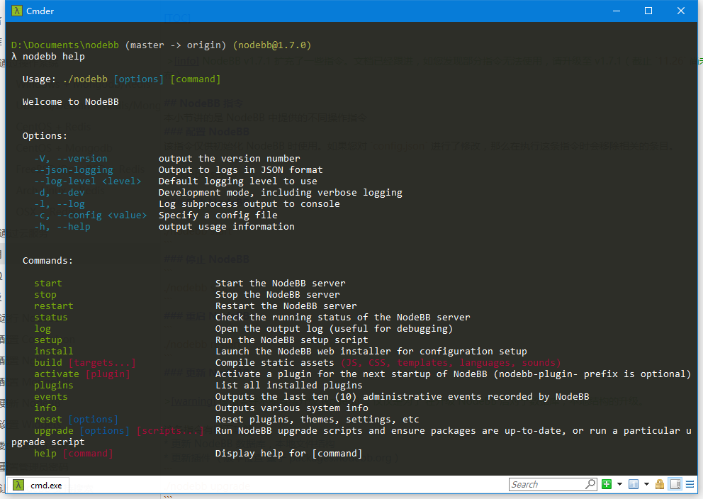
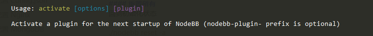

# 使用

[TOC]

  
 >[info] NodeBB v1.7.1 扩充了一些指令。文档已经跟进，如您发现部分指令无法使用，请升级至 v1.7.1（截止 `11.26` 尚未发布）   
 


目前，脚本提供了几个选项参数:
```
    -V, --version         输出 NodeBB 版本号
    --json-logging        以 JSON 的形式输出日记
    --log-level <level>   指定默认显示的日记最低等级，如 `info`
    -d, --dev             开发模式 （默认日记等级为: `verbose`）
    -l, --log             同时将日记输出到终端 (console) 中
    -c, --config <value>  指定 config 文件的位置
    -h, --help            输出使用帮助
```
## NodeBB 指令
本小节讲的是 NodeBB 中提供的不同操作指令
### 启动 NodeBB
> 
```
./nodebb start
```
### 停止 NodeBB

```
./nodebb stop
```
### 重启 NodeBB
```
./nodebb restart
```
### 查看 NodeBB 运行状态


```
./nodebb status
```
### 查看日记

通过该指令，你可以查看到 NodeBB 运行过程中记录的一些事件，以及错误。为了方便排查问题，请在询问问题前，附带该界面的截图！
```
./nodebb log
```
### 配置 NodeBB
该指令仅供初始化 NodeBB 时使用。如果您对 `config.json` 进行了修改，那么在执行这条指令时会移除相关的条目。
```
./nodebb setup
```
### 启动 NodeBB 安装服务


启动 NodeBB 的 Web 安装页面来进行直观得进行配置 NodeBB
```
./nodebb install
```
### 编译静态文件


```
./nodebb build [targets]
```
> 如果不指定对象，默认全部编译
可指定的编译对象:
```
     对象                                                   |  别名
     --------------------------------------------------------------------------------------------------------------------------------------------
     "plugin static dirs"         # 插件静态目录             |  staticdirs
     "requirejs modules"          # require载入的js模块      |  rjs, modules
     "client js bundle"           # 客户端(浏览器)使用的js    |  clientjs, clientscript, clientscripts
     "admin js bundle"            # Admin面板使用的js        |  adminjs, adminscript, adminscripts
     "javascript"                 # 全部的 js               |  js
     "client side styles"         # 客户端样式文件(less,css)  |  clientcss, clientless, clientstyles, clientstyle
     "admin control panel styles" # Admin 面板的样式文件      |  admincss, adminless, adminstyles, adminstyle, acpcss, acpless, acpstyles, acpstyle
     "styles"                     # 全部的样式文件            |  css, less, style
     "templates"                  # tpl模板文件              |  tpl
     "languages"                  # 语言文件                 |  lang, i18n
     "sounds"                     # 声音文件                 |  sound
```
### 更新 NodeBB


>[warning] 该指令并不能直接升级 NodeBB ，仅仅是为了 在升级 NodeBB 后对于数据库，本地结构的升级。

该条指令有以下功能:
* 更新 NodeBB 数据库，本地文件结构
* 更新插件 （版本检查 基于 packages.nodebb.org）
* 直接执行指定的升级脚本（用于解决未正确更新的问题）

你也可以只使用他的部分选项，以直接使用你想要的功能:
```
选项:

    -m, --package  从 defaults 文件更新 package.json
    -i, --install  更新基础依赖
    -p, --plugins  检测插件更新
    -s, --schema   更新 NodeBB 数据库结构
    -b, --build    重新编译静态资源
    -h, --help    输出使用帮助信息
 ```
```
./nodebb upgrade
```
### 查看环境信息

该指令用于查看当前系统安装的 NodeBB 版本 以及数据库(Redis,Mongodb)版本
```
./nodebb info
```
### 查看已启用插件列表

```
./nodebb plugins
```
### 启动的同时，查看日记

```
./nodebb slog
```

### 查看管理员操作事件（近10个）

通过该指令，可以很方便得观察到管理员的操作事件，以便在特殊情况下排查是哪个成员，破坏/修改了程序。
```
./nodebb events
```

### 开发者模式 (1.7.1 起 不再是直接的指令)
该模式有如下特点:
* 直接启动，附带日记。日记更加详细。
* 插件库直接读取，无需编译。
* 信息更加详细。
* 关闭窗口，进程终止。

**需要注意: 开发者模式中读取的插件模板仍然是编译过的模板，所以插件模板如果变动，请先编译模板。**
```
./nodebb --dev start
```
同时，经过测试发现。依旧支持老版本的启动方式:
```
./nodebb dev
```
### 重置功能


```
# 参数
使用 ./nodebb reset {-t|-p|-w|-s|-a}
    -t	主题 [主题名]
    -p	插件 [插件名]
    -w	窗口部件
    -s	设置
    -a	以上所有
```
插件和主题的标识  (-p & -t) 可以禁用单一成员
例如: ./nodebb reset -p nodebb-plugin-mentions, ./nodebb reset -t nodebb-theme-persona
前缀是可选的，例如:. ./nodebb reset -p markdown, ./nodebb reset -t persona

#### 插件
* 停用所有插件
```
./nodebb reset -p
```
* 停用指定插件 
```
./nodebb reset -p plugin-name
```
#### 主题
* 重置至默认主题
```
./nodebb reset -t
```
* 重置至指定主题(相当于切换主题)
```
./nodebb reset -t theme-name
```

#### 窗口部件
禁用所有的窗口部件
```
./nodebb reset -w
```

#### 设置
恢复默认设置
```
./nodebb reset -s
```
#### 重置所有
回到初始化状态
```
./nodebb reset -a
```
### 激活插件

该指令将会在下一次NodeBB启动时激活插件。

> [info] 前缀 `nodebb-plugin` 是可选的

```
./nodebb activate plugin-name
```
## 社区使用

>[info] 该块暂未编辑。目前请各位自行摸索吧，挺简单的。
 
--------------
>[info] 编写: PA Team
维护: PA Team
审核: PA Team
最后更新: 2017.11.26