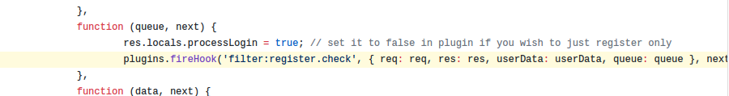

## 开发
NodeBB 开发其实是一种比较繁琐的事情。
**你很可能会遇到如下的问题:**
1. 难调试 
2. 文档残缺
3. Hook 不全
4. Node.js 本身自己存在的错误消息问题（比如:回调堆栈无法帮你定位到错误）

### 难调试
**为什么说 NodeBB 插件难调试?** 
**1. 本地测试比较繁琐**
尽管我们推荐使用 诸如：`npm link` , `yarn link`, `pnpm link` 之类的链接方式调试应用， 但是显然这种方式不适合全部插件。
最典型的例子就是 `SSO` 插件， 由于这类插件的要求比较苛刻， 很可能要求你必须在生产环境测试。 这时 `link` 不再易用， 转而只能使用 `npm i git-packages` 这类方式进行调试。这种情况下，每次对插件进行更改， 必须修改版本号才能正常更新， 调试起来十分麻烦。

> **注:** SSO 方案下， 尽管本地可以调试。 但对于新手可能要求较高， 需要配置本地 web 环境， 以及 hosts 域名 至 127.0.0.1。 故， 我们将新手习惯于在生产环境测试 SSO 的情况作为本点的案例。

**2. 报错机制不合理**
在 NodeBB v1.7.x,  `csrf_invalid` 是其最难以定位的错误之一。这种错误， 小到 `config.json` 配置错误可能引起， 大到插件 JS 回调错误， 客户端 JS 编译错误引起。我们对于这种情况， 只能 `./nodebb reset -p` 禁用所有插件， 然后一一启用， 最后确定问题插件， 进行修复。在整个修复过程中， 也只能是逐句测试， 无法快速定位到问题位置。

还有另一个典型:  往 `adminHeader` 添加 **名称** , 添加插件路由。
  访问地址，终端日记显示空路由，无报错信息。这种情况同样也很难调试。常常无意间引起，又在逐行测试时修复。很难找到问题的根源（请确保你已执行 `./nodeb build`， 让你的插件模板编译进去）

编译器的设计也不是十分合理。有时，你很兴奋看到编译器: `successful`，但打开社区一看: `nodebb.min.js` 里的内容为 `undefined.`。这是什么问题呢？ 其实解决的方法很简单: `不要使用ES6 / 2015 中定义的语法即可`. 当时我在书写这个文章的时候， 花费了 2 天时间才知道压缩器并不支持 ES6 语法. 当知道问题的时候，真是哭笑不得。

>[warning] **NodeBB 1.8.x 之后， 不再使用 uglify-js, 转而使用 uglify-es。 这意味着所有符合标准的 JS 语法都可以正常使用了。**

### 文档残缺
**为什么说 NodeBB 文档残缺呢？**
这是一个插件的例子:

看到这些代码，你觉得怎么样？ 是不是有点儿头疼？前面怎么一大堆 `module.parent.require()`， 他们的作用是啥呀？

没错，这些就是 NodeBB 库。是不是在想， 那还不容易， 库嘛，看文档抄着用就行。 但是，很不幸，能告诉你这些库的作用的文档——并不存在。那么怎么认识他们呢？很简单，只需要阅读 NodeBB 源码即可: https://github.com/NodeBB/NodeBB （手动滑稽）
库有两类：一类是核心库(也就是程序后端使用的)，一类是前端库（用于 Web 页面的 js 库）
* 核心库 : `/src` 下面的
* 前端库（公共库） : `/public/src` 下面的

其实，在开发中——上面都不算难点，都是看源码就能明白的事。 下一环节，理解 NodeBB 中的 Hook 的参数，是你另一个比较艰巨的挑战。
Hook 提供的了两个参数：params ， callback 。前者传参给你，后者用于回调(这种 hook设计 类似于 Express 的 middleware)。
但是，很无奈， NodeBB 给你的 Hook，表面上你只能看到类似于这样的..(如下图)

对于第一次使用的 Hook，你需要手动输出这些参数的内容。才能了解到， 到底传入了什么参数，好做下一步开发。 于是第一个插件， 一开始就出现了大片注释（我也是这么过来的)

> P.S 有时候就算把参数打印出来了，也不知道那个内容能干嘛（手动滑稽）。
> 解决方法：多断点，多测试 (无奈)

### Hook 不全
**为什么说 Hook 不全?**
目前 NodeBB Hook List 提供的是 NodeBB 开发团队认为开发者可能需要的 Hook 。
在实际应用中，很可能会发现你有很多想法，但现有的 Hook 无法为你提供帮助。
比如:

想要在这两个地方插入些内容....但目前还无 Hook 可以直接实现。

> 目前解决方案 : 使用 Client Script 插入标签来解决 。

再比如: 

依然没有 Hook 能快速解决问题。 如果必须要实现的话， 依旧需要依靠 Client Script 来定位这个框 以便添加你自定义的列表。

但， NodeBB 开发团队并不是一个固执的团队， 如果您需要的 Hook 确实是能够改善大部分开发者的开发体验， 或者能解决当前的一些问题的， 他们会十分乐意为你实现。（记得向提交 issue 申请 Hook 哦）

### NodeBB 错误消息缺陷
**为什么说 Node.js 错误消息有问题？**
这个问题，可以参考 T.J 对于 这个问题的讨论。
大致的讨论核心是， Node.js 在某些情况下会造成错误堆栈丢失或者错误定位。 造成难以调试的问题。
一个典型的例子: 

这是在 `1.8.2` 进行编写某插件时， 编译时错误的截图。
由于错误堆栈没有准确告知我们出错位置， 所以我们就认为错误堆栈已经丢失。 在这种情况下， 有堆栈其实和堆栈没什么区别不是吗？
通常会造成堆栈丢失的情况无非这么几种: **流(Stream)处理**(字节流，读写流等）**套接字(Socket)处理** (其实本质上还是流处理) **回调链过长**

尽管 Node.js 经历多次迭代， 社区也在尽力完善对于这种丢失的处理。很可惜，这种问题依旧存在 (上面的例子， 就是目前的 LTS 版本 v8.x 触发的)

由于没有什么妥善的解决方案，我们只能在编写时小心小心再小心。我们始终相信，只需要细心，这个问题可能永远都不会触发。

>[info] **利用  ES 6 的 Promise 可以帮助你更好得处理回调链过长错误丢失的问题**
> 在 NodeBB 中很多造成丢失堆栈的情况就是回调链过长。 令人欣喜的是， 目前 NodeBB 开始逐步向 ES2015/ES6 迁移了。

### 准备开发
能看到这里，我想都是有一定能力的开发者了。对于上面的问题，都已经有一定的想法了了。我们很欢迎你加入 NodeBB 的开发者大家庭！NodeBB 目前还是一个比较小众的群体，所以有这些缺陷也不足为奇。让我们一起面对这些缺陷，为 NodeBB 编写出一个美好的明天吧！

>[info] 编写: a632079
维护: PA Team
审核: PA Team
最后更新: 2018.05.06