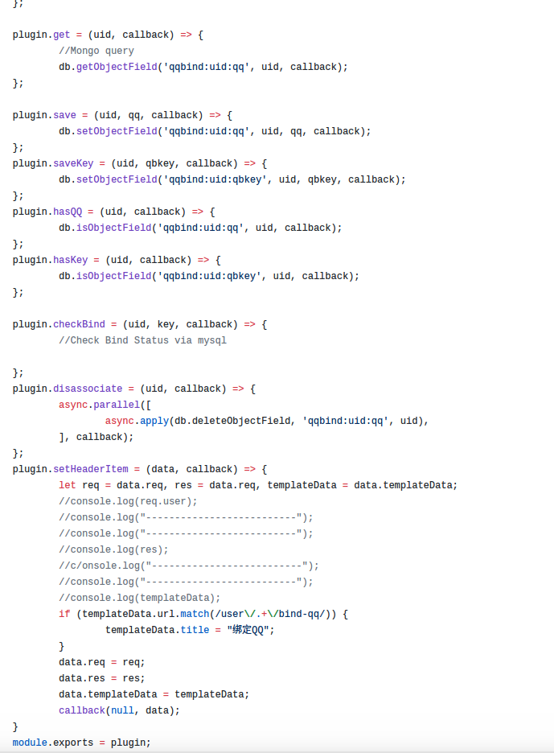

## 开发
NodeBB 开发其实是一种比较繁琐的事情。
**你很可能会遇到如下的问题:**
1. 难调试 
2. 文档残缺
3. Hook 不全
4. Node.js 本身自己存在的错误消息问题（比如:回调堆栈无法帮你定位到错误）

### 难调试
**为什么说 NodeBB 插件难调试?** 
**1. 本地测试比较繁琐**
首先，NodeBB 的插件实则就是 Node.js 的包，它放置在 `./node_modules`中. 
如果你需要编写的插件拥有依赖? 那么，很抱歉...你在本地调试的时候就十分麻烦。你需要在移动插件到 `./node_modules` 之前，使用`npm i dependence_name `，然后修改 `const uuid = require("uuid")` 为 `const uuid = module.parent.require("uuid")`。这样在调试的时候才不会报告模块丢失错误...上线前你还得改回来，十分麻烦。

有没有别的解决方案? 有，当然有！ 你只需要把你的插件发布到 Github 中，然后用 npm 安装 Github 插件的方法安装它即可。 （你也可以选择 Coding/OSChina 只需要采用.git文件的方式安装即可）
虽然这个方法简单了很多，但缺点太明显了: 每次都需要 commit  ，然后 再从 npm 那边拉，十分麻烦。特别是出现了很难定位的问题的时候，你压根无法定位....这种方式来进行更新...在实际的调试中其实比第一种更费力。
**2. 报错机制不合理**
emmmm,这个点比较坑爹...最常见的错误就是 csrf_invalid ..先不提主程序配置时也可能会导致这种错误...如果是你的插件导致的..在没有任何定位的情况下，你很难发现错误来解决。

另一个比较经典的例子: 往 adminHeader 添加 name 以及 添加插件路由，后台空路由，而且没报错信息。这类错误是最坑爹的...无意间引起，又莫名修复...（请确认你已执行 `./nodeb build`， 让你的插件模板编译进去）

编译器的设计其实也不是十分合理。当你很兴奋看到编译器: `successful`，但打开社区一看: `nodebb.min.js`：`undefined.`。握草，什么鬼？啥错误？其实解决的方法很简单: `不要使用ES6 / 2016 中定义的语法即可`.....但是就是没报错 ，是不是很坑爹。

### 文档残缺
**为什么说 NodeBB 文档残缺呢？**
这是一个插件的例子:

估计大部分人看见会比较头疼...前面怎么一大堆 `module.parent.require()`。他们的作用又是什么呢？

没错，这些就是 NodeBB 库。但很不幸的告诉你，能告诉你这些库的作用的文档——并不存在。那么怎么认识他们呢？很简单，只需要阅读 NodeBB 源码即可: https://github.com/NodeBB/NodeBB
库有两类：一类是核心库(也就是程序后端使用的)，一类是前端库（用于 Web 页面的 js 库）
* 核心库 : `/src` 下面的
* 前端库 : `/public/src` 下面的

其实，在开发中...上面都不算难点，至少只是看源码就能懂了。 理解 NodeBB 中的 Hook 的参数，是你下一个比较艰巨的挑战。
Hook 提供的了两个参数：params ， callback 。前者传参给你，后者用于回调(这种 hook设计 类似于 Express 的 middleware)。
但是，最坑爹是...NodeBB 给你的 Hook，表面上你只能看到类似于这样的..(如下图)

对于第一次使用Hook，你需要手动输出这些参数的内容...才好做下一步开发...于是就有了上面 demo 中的大片注释。:D P.S 有时候就算你打印出来了，你也不知道那个内容能干嘛（手动滑稽）。解决方法：多断点，多测试 233

### Hook 不全
**为什么说 Hook 不全?**
目前 NodeBB Hook List 提供的是官方认为需要的 Hook ，在实际应用中....你会发现你有很多好的想法，但 Hook 里面根本没办法帮你实现。
比如:

我只是基本的想要在这两个地方插入些内容....但没 Hook 实现:( 我的解决方案 : 使用 Client Script 插入标签来解决 。

再比如: 

有 Hook 能帮你吗？假的，不存在的。你依旧需要依靠 Client Script 来定位这个框 以便添加你自定义的列表。

### NodeBB 错误消息缺陷
**为什么说 Node.js 错误消息有问题？**
有关这个点，可以参考 T.J 对于 这个问题的讨论。
你只需要小心即可，虽然这个问题可能无法避免。但你只需要细心，这个问题可能你永远都不会触发。（官方已经很努力的在完善这个点了。）

>[info] 利用  ES 6 的 Promise 可以帮助你更好得处理错误:D

### 准备开发
能看到这里，我想都是有一定能力的开发者了。对于上面的问题，自已都已经有一定的思路了。我们很欢迎你加入 NodeBB 的开发者大家庭！NodeBB 目前还是一个比较小众的群体，所以有这些缺陷也不足为奇。让我们一起面对这些缺陷，为 NodeBB 编写出一个美好的明天吧！

>[info] 编写: a632079
维护: PA Team
审核: PA Team
最后更新: 2017.08.15